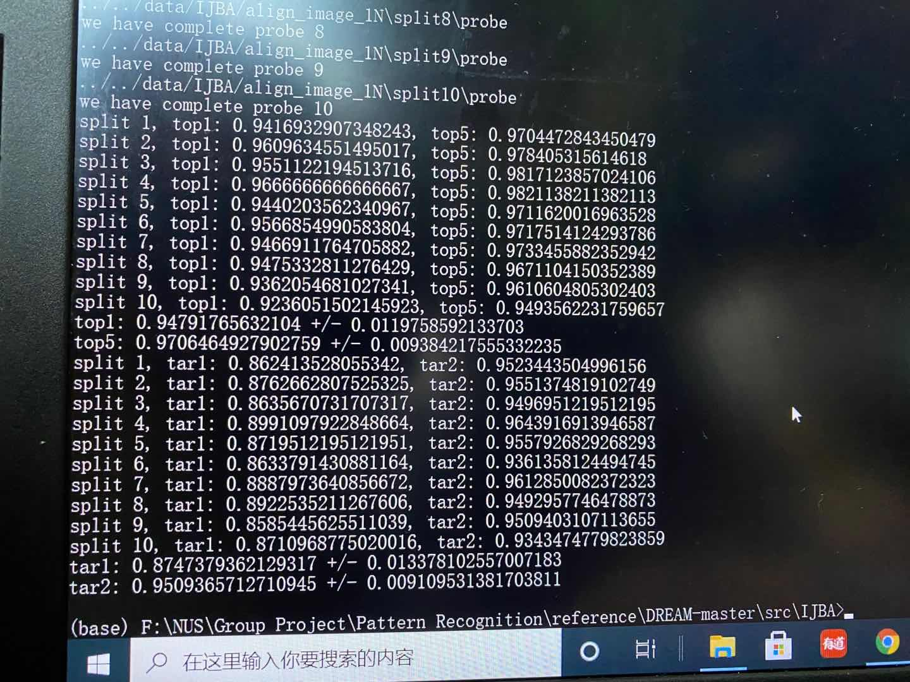

# FaceGuard
## Attention
1. Please push your code in your own branch named as "xx\_dev"
2. don't push any big files, please use .gitignore to filter them.

## to-do list
1. ~~用IJBA数据集作为evaluation dataset对整个特征提取器进行评估~~
2. ~~对所有已有的图片进行提取特征~~
3. ~~测试组员的top1输出~~
4. fine-tune模型
5. 写好一套流程：图片-特征-对比-结果
6. 写好接口

## progress
### 1. evaluation

### 2. 对所有已有图片提取特征
`write_img.py` 记录probe集和gallery集的文件名和yaw

`selfDefine_1.py` 修改了`load_imgs`函数

`add_team.py` 提取特征输出为bin文件，存到`../../data/team/`里

### 3. 测试组员的top1输出
`write_csv.py` 对应id和img名

`test_team.py` 进行recog的测试——发现代码是把同一个人的多有图片的feature取均值，
于是修改代码（其实只是修改了csv的template，给他弄成unique的就可），然后开始测试。
发现欧洲人的都可以很好的识别，但是亚洲人就不行，于是打算做fine-tune。现在选取的数据集是
CASIA-FaceV5，该数据集包含了来自500个人的2500张亚洲人脸图片.

当前的测试流程：

1. 把图片加入probe和gallery文件夹中

2. `write_img.py`来写入img_list

3. `add_team.py`生成bin文件

4. 手动修改csv文件（后续优化）

5. `test_team.py`输出预测结果

### 4. fine-tune模型
`alignment.py`

利用dlib库对人脸进行检测，根据内眼角和水平线的夹角旋转图片

`cropFaces.py`

利用dlib库对人脸进行检测并crop出来，存入到`64_CASIA-FaceV5/cropped/`对应的sub目录中

`test_train_split.py`

分开train和test的数据

`label_img.py`

写list.txt和label.txt

`train.py`&`delfDefine.py`
修改了一部分内容 适合我们的数据集 这里的yaw我都写成了0，先看看训练结果，不好再细分

